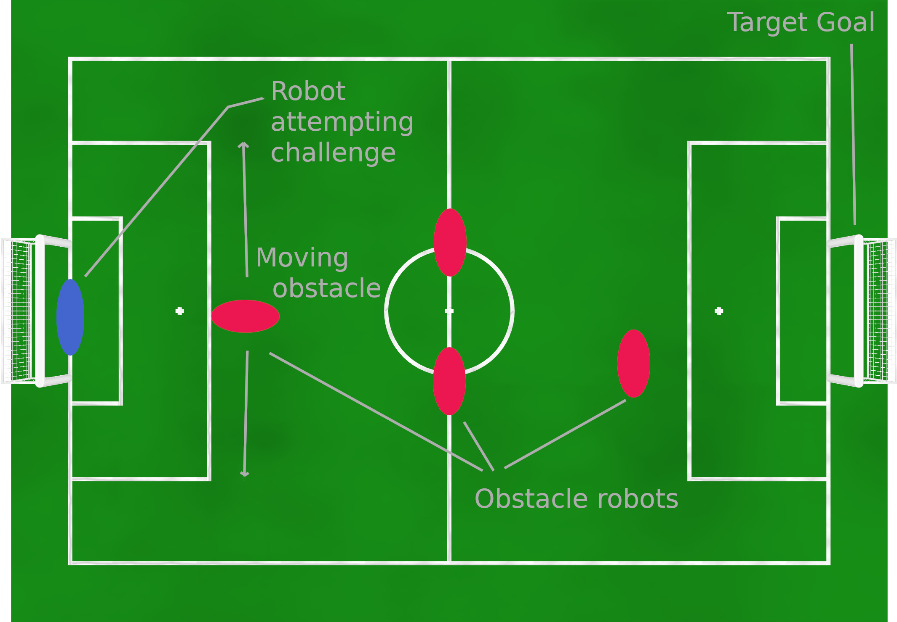

# Obstacle avoidance challenge

Technical Challenge for RoboCup 2020 SPL Championship. Version from 3. Jun 2020.

## Goal

Teams at RoboCup 2019 self-reported working on/having finished improvements of their obstacle avoidance. Replacing the most simple obstacle avoidance implementation (don't walk forward if you don't see field color in front of you) should be encouraged by the league. This challenge gives teams to display their improvements in obstacle avoidance. It might aid in lowering the amount of pushing during games.

## Setup

A ball is placed on the penalty cross point closest to the starting point of the robot. The challenged robot is placed on the goal line of the goal that is opposite of the target goal. Between ball and target goal three obstacles are placed.

- One moving robot as an obstacle. This robot is continuously moving back and forth along an imaginary line oriented along the short axis of the field, facing the direction of travel as it moves. The distance travelled by the robot is approximately the width of the penalty area (see dimension H of section "Field Construction" of the SPL rules).
- One stationary robot as an obstacle, facing down the long dimension of the field, offset to the left or right so its outermost shoulder point is a balls radius away from the imaginary line between kick-off point and center of the target goal.
- Two stationary robots as an obstacle, facing down the long dimension of the field, positioned offset to the sides so dribbling a ball in between them is the fastest route to the target goal. The space in between them the sum of the robots' shoulder-to-shoulder width and a balls diameter.

With regard to the position of the obstacles along the long axis of the field: One obstacle is placed on the center line. The other two obstacles are placed one balls width away from the penalty area towards the center of the field.

The order of the obstacles are set up in (i.e. which kind of obstacle stands in which position, and the offset side of the one stationary robot) is randomized by dice throw at the competition before the first team is challenged. Thus no team is aware of the exact setup beforehand and all teams face the same challenge.

Obstacle robots may wear any jersey. Which jerseys are not specified beforehand so teams cannot prepare for specific jerseys.

## Challenge management and planning

The date, time and field used for the challenge will be announced at RoboCup 2020. In the 30 minutes leading up to the challenge all participating teams must deliver their participating robot and place it along the outside of the field with the robots turned off.

The order of the obstacles is randomized by dice throw while all participating robots are turned off.

The team currently challenged and the two upcoming teams may turn on and set up their robots for the challenge. Teams must be able to set up robots for participating within 90 seconds of being asked.  Teams are informed of their order of participation in the challenge by the judges. Teams that have completed the challenge must disconnect from the fields wireless network. Thus avoiding the whole league joining a single fields wireless AP.

Teams hand over their robots to the judges to be placed on the field. The challenge is started by a judge pressing the chest button of the robot once.

## Scoring

The challenged robot is tasked to advance with the ball into the target goal. Both dribbling and kicks are permitted to move the ball. The maximum distance for goal shots is restricted for this challenge. Shots that do not score a goal are unrestricted.

Shots into the goal are only allowed with the center of the ball being within 1.3 meter from the end field line. This threshold is at the same height as the penalty cross (see dimension I of section "Field Construction" of the SPL rules).

Goals shot from a larger distance do not complete the challenge. In this case, the challenged robot is required to walk into the goal, move the ball outside of the goal and score another goal according to the rules of the challenge.

Teams are scored by the time it took to move the ball into the goal (rounded up to full seconds). Lower durations are better. In case of a draw, tied teams are required to repeat the challenge.

If the ball is moved out of the field a judge takes the ball and places it on the kick-off point.

Touching an obstacle with the ball increases the scored duration by 5 seconds. Touching an obstacle with the challenged robot increases the scored duration by 10 seconds.

A robot has at most 3 minutes (penalties excluded) to complete the challenge.
